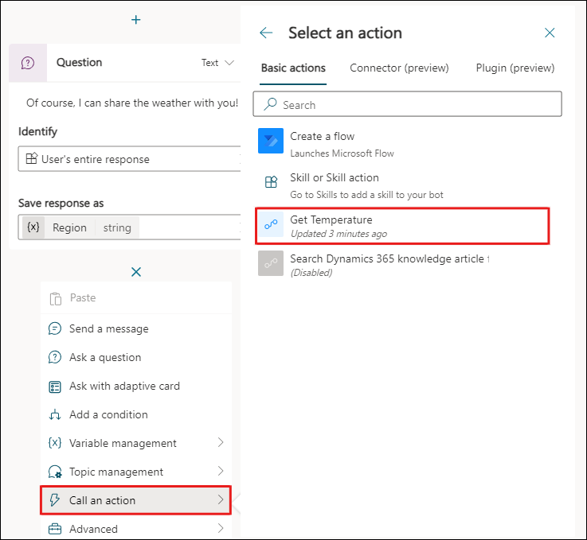
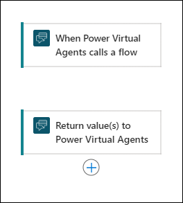
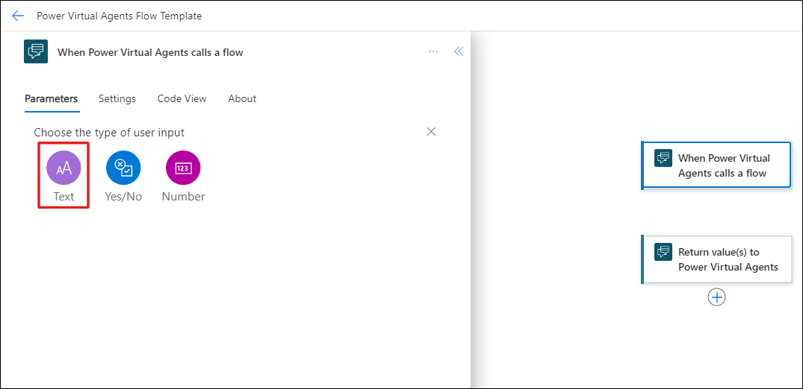
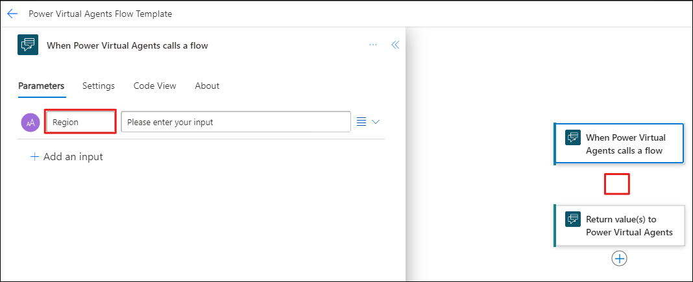
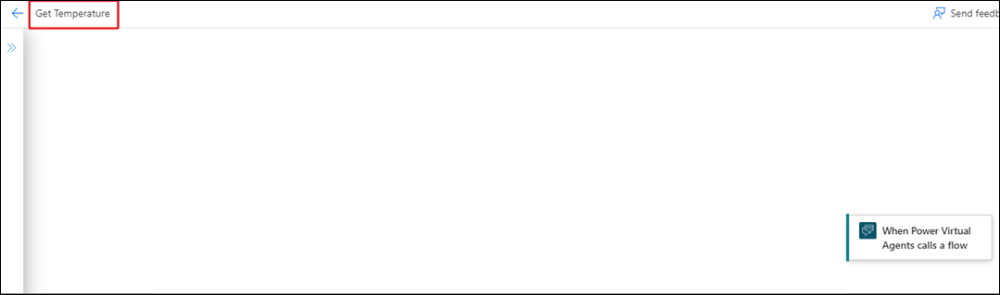
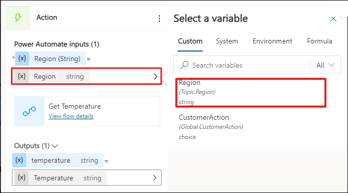
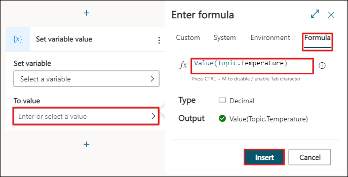
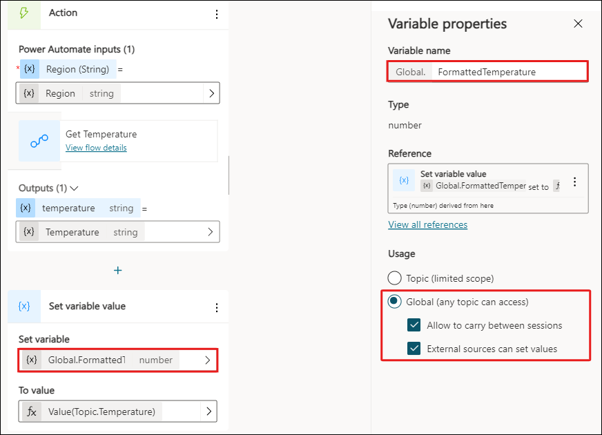
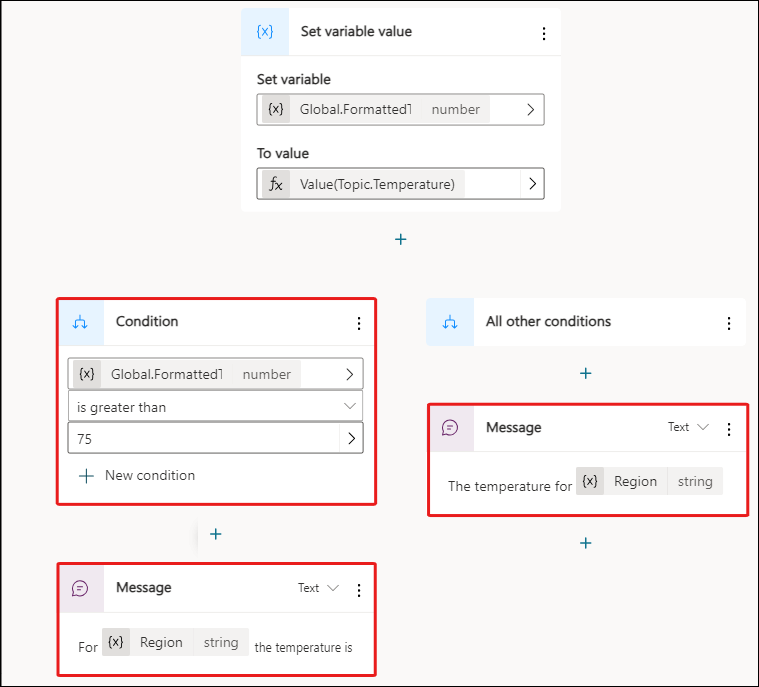

## Lab-03: Build a basic Power Automate flow in Microsoft Copilot Studio.

# Task-01: Create a new topic.

1.Login to **https://copilotstudio.microsoft.com/**

  

2.Create a new copilot named **User 1 Contoso Customer**
   
  
	
3.Open the **Microsoft Copilot Studio authoring canvas** and navigate to the **User 1 Contoso Customer** Copilot you created previously. Select the Topics page from the navigation menu to the left of the screen.

4.Then select the **New Topic** drop down at the top of the page and **choose the From Blank** option. Enter **Check Weather** as the name of your topic.

5.Enter simple trigger phrases that a user might ask, such as **What is the weather** and **What is the temperature today**, until you have at least five trigger phrases. Select the **Edit** button within the node to open a pane to the right of the screen where you can add the trigger phrases.

  

6.Create a **new Question node** below the trigger phrase node and then enter text, such as: **Of course, I can share the weather with you! Can you tell me the name of the region where you want to know the weather?**

  

7.For these modules, you store the User's entire response; however, you could also use the Country or region entity so that you can use slot filling to detect the country/region from the user's response to the question.

>**Note**: You could detect or estimate the user's region from another topic or time zone area system variable.

8.Rename the variable to **Region**. To do so, select the name of the variable within the node. Within a pane that appears to the right of the screen.

  

9.Within the top right corner of the screen, select the Save button to ensure that your work is saved.

## Task-02: Create your Power Automate flow

1.Select the Add node button below the question node to add a new node to the topic. Select Call an action > Create a flow, as shown in the following screenshot. Power Automate opens in a new browser window and includes the scaffolding pre and post actions for a new Power Automate flow to interact with Microsoft Copilot Studio, as shown in the second screenshot.

   

2.Examine the preceding screenshot to note the scaffolding that occurs when you create a new Power Automate flow by using Microsoft Copilot Studio. Two nodes are automatically created. The first node is the input that the flow expects from Microsoft Copilot Studio. You don't need to set inputs within this action; however, a common input would be a user utterance or variable, such as the country/region specified in the example. The second node is the output that a maker can return to Microsoft Copilot Studio after the flow retrieves or completes the operations within the automation.

   

>**Note**: Make sure that you keep the Microsoft Copilot Studio pre and post actions at the top and bottom of your Power Automate flow to ensure that the data can be passed to and from Power Automate from Microsoft Copilot Studio.

3.In the new flow window that opens, select the Add an input within the first scaffolded action. Then, select **Text**.

   

4. Within the first column, enter Region (leaving the second column empty).

5. Then, select the **Insert new step** button to **add a new action**.

   

6. Select the **Add an action** option from the menu.

7. Enter **weather** in the search bar and then select Get current weather by MSN Weather.
    
    

A new node appears, where you can enter the location and units. When you select into the Location field, as shown in the following screenshot, the Dynamic content option displays.

8.Dynamic content is real-time data, and in this scenario, the region data would be the data passed from Microsoft Copilot Studio that you set up at the beginning of the topic and requested from your user. From the Dynamic content drop-down menu, select Region and then keep units as Imperial.

9. You're sending the Region data from the user to the weather service from MSN Weather. The flow will get this data and make it available for you to return to the user in Microsoft Copilot Studio in the next steps.

  

10.Select theReturn value(s) to Microsoft Copilot Studio node at the end of the flow, then select Add an output > Text. Place your cursor in the Enter a value to respond text box. The Dynamic content panel opens from the result of the Get current weather API action in the previous step. Select Temperature from dynamic data to add it to the response text box. Then, enter Temperature in the Title field.

  

11.You built an API request to the MSN Weather service where you entered the Region from Microsoft Copilot Studio. The MSN Weather service retrieves the data for the region, and when you have that data (almost instantly), you can return it to Microsoft Copilot Studio and the user.

12. The flow is almost complete. You need to rename it before you can move on to best practices so that administrators and users can more easily find it in Microsoft Copilot Studio. Select the template title and rename it to Get Temperature, as shown in the following screenshot.

13.Select Save on the flow in Power Automate to ensure that it saves. Wait a moment until the green banner appears, indicating success.

14.You completed your work in Power Automate. Next, you switch to Microsoft Copilot Studio.

## Task-03 : Connect a Power Automate flow with Microsoft Copilot Studio.

1.In this task, you connect a Power Automate flow with Microsoft Copilot Studio.

2.Open your existing topic in Microsoft Copilot Studio, entitled Weather, and return to the bottom of your flow, as shown in the following screenshot. Select Call an action. Your new Power Automate flow displays in the list. From the list, select Get Temperature.

3. When you select the Get Temperature flow, a new Action node is created automatically. If the flow requires an input, it requests that you select the value. Because the flow that you created in the previous steps has the input of Region, you need to add this input into the Power Automate action by selecting the variable that the value is stored in from the user, which is Region, from the previous steps in the lab.

4. Select Enter or select a value and then select the Region variable that you created in previous steps of this lab. This value is now connected to the Power Automate flow and displays the result from Power Automate into the Temperature variable.

5. Now, you can skip to displaying the output in a message by using the variable in a Message node. However, if you're following along with the Contoso Coffee sample data provided in the previous labs, you continue with the steps to make it relevant for the Contoso Coffee scenario. You can convert the returned data, which was a string that was returned from Power Automate, to a number by using Microsoft Power Fx. You can convert that data by adding a Set Variable Value node, which creates a new Global variable called FormattedTemperature.

6. Below the Action node within the topic, select the Add node button. Then, select Variable management > Set a variable value.

7. Next, select the To value field, and choose the Formula tab within the dialog pane. Then, you use the Value Power Fx function to convert this data to a number by using the following syntax:
**Value(Topic.Temperature)** Then, select Insert.

8. Next, select the Set variable field within the node. From the menu, select the Create new variable button.

9. Within the Variable properties pane to the right, enter FormattedTemperature for the Variable name, and select Global for the Usage. Ensure that you also select both check boxes below Global.

   

10. Add a Condition node so that you can check if the Formatted Temperature variable is greater than 75. If so, then a specific message displays. Otherwise, with all other conditions, 
 you display a different message. Add two message nodes for both sides of the conditional statement.

11. The reason why you need to format the data is because the data returned from Microsoft Copilot Studio is a string, and operators such as greater than are only available on types of 
    data that are a number. Using Power Fx is straightforward when you're converting an object's type directly in Microsoft Copilot Studio.

12. For the true branch, if the Formatted Temperature is greater than 75, add the following text within the Message node:

13. For {Region} the temperature is {Global.Temperature} and that is getting warm! Consider cooling off with one of our cold brew coffees.

>**Note**:The braces { } are variables to display dynamic data. To enter variables into the node, use the {X} button on the Message node and then select a variable from the list

14. For the false branch, add the following text within the message node: The temperature for {Region} is {Global.Temperature}. where the braces { } are variables to display dynamic 
    data. To enter variables into the node, use the {X} button on the Message node and then select a variable from the list, as shown in the following screenshot.

        

15. To end the conversation, select the Add node button below the condition. Select Topic management and then choose End conversation.

      

16. ave your topic using the button found in the top right corner of the screen and then use the testing panel to test the flow. Determine if the response is as expected, as shown in the following screenshot.

    
	
17.	You successfully created a Power Automate flow and a new topic in Microsoft Copilot Studio that used the flow to provide real-time data from an external service to the user.

