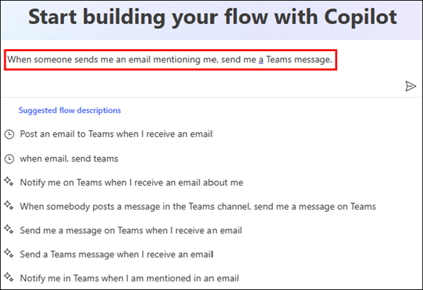
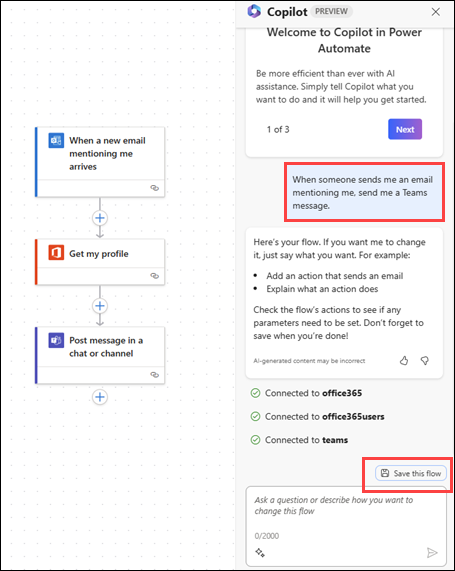
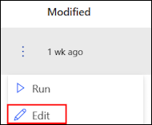

# Lab-04: Create a flow using the cloud flows designer with Copilot (Read Only).

## Task-01: Create a Flow.

1.	Sign in to **https://make.powerautomate.com**.
   
2.	Start to describe your automation scenario.

    
   
3.	To accept the flow that Copilot created for you, select **Next**.
   
4.	Review your connected apps and services, and then select **Next**.
   
5.	To finalize your flow, configure the required settings, and then select **Create flow**.

    

6.	On the panel to the right, follow the Copilot suggestions to complete the flow setup, or make edits to your flow using Edit with Copilot.
   
7.	When your flow is complete, select **Save this flow**.
   
8.	Once your flow is saved, we recommend that you test it. Do this by selecting Test in the upper-right corner.
   
## Task -02 : Edit a flow using the designer with copilot capabilities

1.	Sign in to **Power Automate**.
   
2.	On the left navigation pane, select **My flows**.
   
3.	Find your flow, select the **vertical ellipses (⋮)**, and then select **Edit**.

    
 
      
   >**Note** : Your flow opens with the Copilot pane on the side. You can now edit your flow by using the cloud flows designer with copilot capabilities. Try typing the following prompts.

   - a.	Delete action X.

   - b.	I want to send an email at the end of the flow with subject equal to the SharePoint file name.

   - c .	Instead of email, I want to post message on Teams channel.

   - d.	Check if each of the Sharepoint items being returned has a title that equals 'USB', and if so, send an email.

