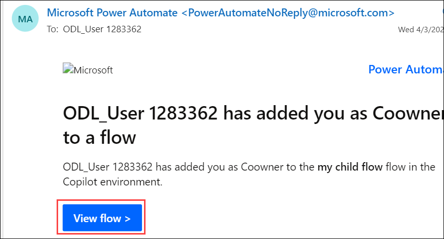
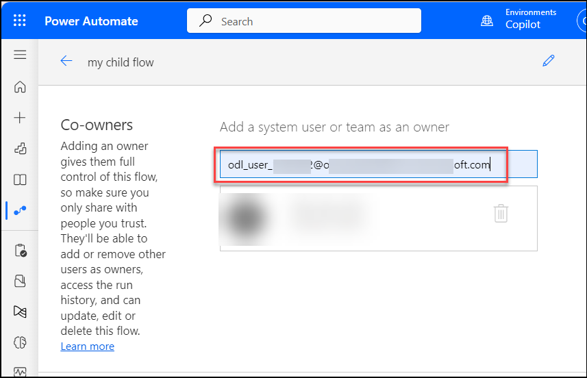
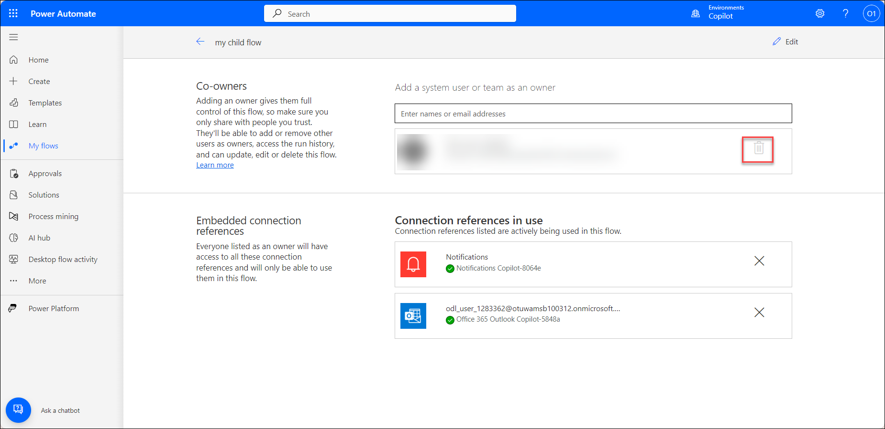

# Lab-05: Share a cloud flow.

## Lab scenario

In this exercise, you will share a cloud flow with others using Microsoft Power Automate. Start by accessing the cloud flow you wish to share in the Power Automate portal. Use the sharing options to grant access to specific users or groups, setting their permissions appropriately. This process will allow collaborators to view, edit, or manage the flow as needed, enabling effective teamwork and workflow management. This lab will demonstrate how to manage and share cloud flows to enhance collaboration and productivity.

## Lab Objectives

In this lab, you will complete the following tasks:

- Task-01 : Create A cloud Flow.
- Task-02: Add an owner to a cloud flow.
- Task-03: Add a list as a co-owner.
- Task-04: Send a copy of a cloud flow.

## Task-01 : Create A cloud Flow

In this task, you'll create a cloud flow in Power Automate to automate a specific process. You'll start by defining a trigger that initiates the flow, then configure actions and conditions to perform the desired tasks. This setup will streamline workflows and improve efficiency by automating repetitive or routine tasks.

1. Sign into **https://make.powerautomate.com/**.
   
2. On the menu to the left, select **Solutions**.
   
3. Create a new **solution** named **Copilot**.

   
    
4. Select **Copilot** under solution and Select **New > Automation > Cloud flow > Automated.**

   

    >**Note**: If an automated cloud flow doesn't meet your requirements, you can create any other type of flow, Power Automate opens.

5. Give your flow a name as **my child flow**.
   
6. Search for, **new email** in the Search all triggers box.
   
7. Select the **When a new email arrives (V3) trigger**.

   
        
8. Select **Create**.
    
9. Select **New step**.
	
10. Search for **Notification**, and then select the**Send me a mobile notification action**.

    

11. Add the Subject dynamic token to the Text field of the Send me a mobile notification card.

    

12. Select **Save** to save your flow.
    
13. Go back and Select **Solutions** to see your flow in the solution.

    

## Task-02: Add an owner to a cloud flow.

In this task, you'll add an owner to a cloud flow in Power Automate. You'll access the flow's settings and use the sharing options to assign ownership to a new user or group. This process ensures that the designated owner has full control over the flow, including the ability to manage, edit, and configure it as needed.

1. Adding an owner to a cloud flow is the most common way to share a cloud flow. Any owner of a cloud flow can perform these actions:
   
2. View the **run history**.
   
3. Manage the properties of the flow (for example, start or stop the flow, add owners, or update credentials for a connection).
   
4. Edit the definition of the flow (for example, add or remove an action or condition).
   
5. Add or remove other owners (but not the flow's creator), including guest users.

    > Note: The creator or an owner of a cloud flow, you'll find it listed on the Team flows tab in Power Automate, Shared connections can be used only in the flow in which they were created.Owners can use services in a cloud flow but can't modify the credentials for a connection that another owner created.To add more owners to a cloud flow:

6. Sign in to **https://make.powerautomate.com/**, and then select **My flows**.
   
7. Select the flow that you want to share, select the **vertical ellipsis (⋮)**, and then select **Share**.

    
    
8. Enter the name, email address, or group name for the person or group that you want to add as an owner.

    
    
9. The user or group you've selected becomes an owner of the flow.

## Task-03: Add a list as a co-owner

In this task, you'll add a list of users as co-owners to a cloud flow in Power Automate. You will access the flow's settings and use the sharing options to designate multiple users or groups as co-owners. This allows them to collaborate on managing, editing, and configuring the flow, ensuring efficient teamwork and shared responsibility.

1. Create and set up a SharePoint list.
   
2. Use a list when the flow is connected to SharePoint, and use a group in all other cases.

3. On the flow details page, in the Owners section, select **Edit**.
   
4. Select **Delete**(the trash can) for the owner you want to remove.
   
5. In the confirmation dialog box, select **Remove**.

    
   
## Task-04: Send a copy of a cloud flow

In this task, you'll send a copy of a cloud flow to another user in Power Automate. You'll navigate to the flow you wish to share, use the options to create a copy, and send it to the intended recipient. This process allows the recipient to have their own version of the flow, which they can modify or use independently.

1. On the flow details page command bar, select **Send a copy**.
   
2. On the Send a copy panel, you can edit the name and description of the flow you want to share, and specify the users with whom you want to share it.the recipient will receive an email stating that you have shared a cloud flow template with them, and they can then create their own instance of that flow.

    

## Summary 

In this lab, you have accomplished the following:

- You have created a cloud flow to automate a specific process.
- You have added an owner to the cloud flow for full control and management.
- You have designated a list of users as co-owners to enable collaborative management.
- You have sent a copy of the cloud flow to another user for independent use or modification.

 ## You have successfully completed the lab
 

